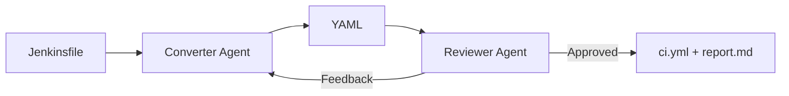

# AgenticConverter

> CLI tool that converts Jenkinsfiles to GitHub Actions workflow YAML using a local LLM and an iterative agentic loop.

## Overview

AgenticConverter reads a Jenkinsfile (or a directory of Jenkinsfiles), sends it to a locally-hosted LLM, and produces GitHub Actions YAML. A **reviewer agent** evaluates the output and iterates with the converter until the result is approved or a max iteration count is reached. A **conversion report** (`report.md`) is generated alongside each output, providing confidence scoring and a manual verification checklist.



> For a comprehensive architectural walkthrough, design rationale, and pitch presentation, see [docs/PITCH.md](docs/PITCH.md).

## Prerequisites

- **Python 3.10+**
- **[uv](https://docs.astral.sh/uv/)** — Python package manager
- **Local LLM Server** — e.g., [LM Studio](https://lmstudio.ai/) or [LightLLM](https://github.com/ModelTC/lightllm) (for remote proxying) exposing an OpenAI-compatible API.
  > *Example:* A local model like `Qwen2.5-Coder` works well for this PoC.

## Quick Start

```bash
# 1. Install dependencies
uv sync

# 2. Configure LLM connection
cp .env.example .env
# Edit .env with your LM Studio URL (default: http://localhost:1234/v1)

# 3. Start your LLM server (e.g., LM Studio) and load a code model

# 4. Place Jenkinsfiles in .data/input/
mkdir -p .data/input/1
cp /path/to/your/Jenkinsfile .data/input/1/Jenkinsfile

# 5. Convert a single Jenkinsfile
uv run python -m src.main .data/input/1/Jenkinsfile

# 6. Or convert all Jenkinsfiles in a directory
uv run python -m src.main .data/input/
```

## CLI Reference

```
usage: main.py [-h] [-V] [-o DIR] [-n N] [-v] path

positional arguments:
  path                     Jenkinsfile or directory containing Jenkinsfiles

options:
  -h, --help               Show this help message and exit
  -V, --version            Show version from config.json
  -o, --output-dir DIR     Output directory (default: .data/output)
  -n, --max-iterations N   Max converter↔reviewer iterations (default: 5)
  -v, --verbose            Enable verbose output
```

### Examples

```bash
# Single file (positional argument)
uv run python -m src.main .data/input/1/Jenkinsfile

# Batch with verbose
uv run python -m src.main .data/input/ -n 3 -v

# Custom output directory
uv run python -m src.main .data/input/ -o results/

# Check version
uv run python -m src.main --version
```

## Configuration

Three-layer configuration with clear precedence: **CLI > Environment > config.json**

| Layer | File | Purpose |
|---|---|---|
| Defaults | `config.json` | App behavior (version, max_iterations, output_dir) |
| Secrets | `.env` | LLM connection (LLM_BASE_URL, LLM_API_KEY, LLM_MODEL) |
| Overrides | CLI args | Per-run overrides (-n, -o, -v) |

### Working Data

All runtime data lives in `.data/` (gitignored):

| Directory | Purpose |
|---|---|
| `.data/input/` | Place Jenkinsfiles here for conversion |
| `.data/output/` | Generated GitHub Actions YAML + conversion reports |

## Repository Structure

```
AgenticConverter/
├── src/
│   ├── main.py              # CLI entry point + ALL file I/O
│   ├── config/manager.py    # 3-layer config loading and merging
│   ├── agents/
│   │   ├── converter.py     # Jenkinsfile → YAML via LLM
│   │   └── reviewer.py      # Evaluates YAML, returns APPROVED/CHANGES_NEEDED
│   ├── graph/pipeline.py    # PipelineState model + agentic orchestration loop
│   ├── report/generator.py  # Conversion report (confidence, checklist, history)
│   ├── llm/client.py        # OpenAI SDK wrapper (Dependency Injection)
│   └── prompts/             # System prompts as Markdown files
├── tests/                   # pytest suite (runs offline, no LLM needed)
├── specs/                   # Feature specifications (Spec Kit methodology)
│   ├── 001-agentic-converter/
│   └── 002-conversion-report/
├── docs/
│   ├── CASE.md              # Original customer case brief
│   └── PITCH.md             # Pitch presentation (architecture, rationale, diagrams)
├── config.json              # App defaults
├── constitution.md          # Project principles
├── CHANGELOG.md             # Version history
├── CONTRIBUTING.md          # Contribution guidelines
└── LICENSE                  # MIT License
```

## Testing

```bash
uv run pytest           # All 43 tests (no LM Studio needed)
uv run pytest -v        # Verbose
```

## Documentation

Each piece of information lives in exactly **one place**:

| What | Where |
|---|---|
| Project principles | [constitution.md](constitution.md) |
| Feature requirements | [specs/001-agentic-converter/spec.md](specs/001-agentic-converter/spec.md) |
| Technical design | [specs/001-agentic-converter/plan.md](specs/001-agentic-converter/plan.md) |
| Pitch & architecture | [docs/PITCH.md](docs/PITCH.md) |
| Original customer brief | [docs/CASE.md](docs/CASE.md) |
