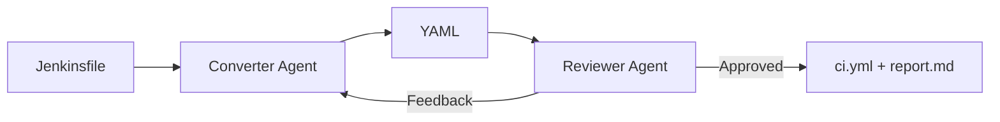

# Agentic Converter

Python-first CLI that converts Jenkinsfiles into GitHub Actions workflow YAML using a locally-hosted LLM and an iterative agentic converter-reviewer loop.

## Purpose

Agentic Converter is built for teams migrating CI from Jenkins to GitHub Actions who want:

- fast first-pass workflow conversion
- iterative quality control via an LLM reviewer pass
- an auditable conversion report (`report.md`) per output

## How It Works

- Reads a [Jenkinsfile](docs/data-demo/input/1/Jenkinsfile) (or a directory of Jenkinsfiles) as conversion input.
- Converter agent sends Jenkins pipeline content to LLM and generates GitHub Actions workflow YAML.
- Reviewer agent evaluates the generated workflow output.
- Iterates converter and reviewer until the result is approved or a max iteration count is reached.
- Produces final GitHub Actions YAML ([ci.yml](docs/data-demo/output/1/ci.yml)) and conversion report ([report.md](docs/data-demo/output/1/report.md)) for each output, including confidence scoring and a manual verification checklist.



## Architecture Pitch

- High-level technical pitch (deep dive): [`docs/PITCH.md`](docs/PITCH.md)

## Tech Stack

- Core runtime: `Python 3.10+`, `uv`
- LLM runtime: Local OpenAI-compatible server such as `LM Studio` or `LightLLM`
- LLM integration: `openai` SDK client wrapper against local OpenAI-compatible endpoints
- Data modeling: `Pydantic`
- Quality and testing: `pytest` (offline, mocked LLM client)

## Quick Start

```bash
# 1. Install dependencies
uv sync

# 2. (Optional) Add local overrides
cp config/config.local.example.json config/config.local.json
# Edit config/config.local.json as needed (e.g., output_dir)

# 3. Start your LLM server (e.g., LM Studio) and load a code model

# 4. Place Jenkinsfiles in .data/input/
mkdir -p .data/input/1
cp /path/to/your/Jenkinsfile .data/input/1/Jenkinsfile

# 5. Convert a single Jenkinsfile
uv run python -m src.main .data/input/1/Jenkinsfile

# 6. Or convert all Jenkinsfiles in a directory
uv run python -m src.main .data/input/
```

## CLI

```
usage: agentic-converter [-h] [-V] [-o DIR] [-n N] [-v] path

positional arguments:
  path                  Jenkinsfile or directory containing Jenkinsfiles

options:
  -h, --help            show this help message and exit
  -V, --version         show program's version number and exit
  -o, --output-dir DIR  Output directory (default: from config/config.json)
  -n, --max-iterations N
                        Max converter↔reviewer iterations (default: from config/config.json)
  -v, --verbose         Enable verbose output
```

### Examples

```bash
# Single file (positional argument)
uv run python -m src.main .data/input/1/Jenkinsfile

# Batch with verbose
uv run python -m src.main .data/input/ -n 3 -v

# Custom output directory
uv run python -m src.main .data/input/ -o results/

# Check version
uv run python -m src.main --version
```

## Configuration

Three-layer configuration with clear precedence: **CLI > config/config.local.json > config/config.json**

| Layer | File | Purpose |
|---|---|---|
| Defaults | `config/config.json` | App behavior (max_iterations, output_dir, verbose, LLM settings) |
| Local Overrides | `config/config.local.json` | Optional machine-specific non-secret overrides (gitignored recommended) |
| Overrides | CLI args | Per-run overrides (-n, -o, -v) |

Use `config/config.local.json` for machine-specific overrides you want outside git. Keep long-term defaults in `config/config.json`.

### Working Data

Conversion data lives in `.data/`.
For a real generated dataset, see `docs/data-demo/`.

| Directory | Purpose |
|---|---|
| `.data/input/` | Jenkinsfiles to be converted |
| `.data/output/` | Generated GitHub Actions YAML + conversion reports |

## Repository Structure

```
agentic-converter-py/
├── .codex/                  # Codex assistant project configuration
├── .specify/                # SpecKit templates and helper scripts
├── .data/                   # Runtime conversion data
├── config/
│   ├── config.json               # App defaults (single source of truth)
│   └── config.local.example.json # Optional local override template
├── docs/
│   ├── data-demo/           # Real conversion input/output examples
│   ├── CASE.md              # Original customer case brief
│   └── PITCH.md             # Pitch presentation (architecture, rationale, diagrams)
├── specs/                   # Feature specifications (SpecKit methodology)
├── src/
│   ├── main.py              # CLI entry point + ALL file I/O
│   ├── config/manager.py    # config/config.json + config/config.local.json loading and merging
│   ├── agents/
│   │   ├── converter.py     # Jenkinsfile → YAML via LLM
│   │   └── reviewer.py      # Evaluates YAML, returns APPROVED/CHANGES_NEEDED
│   ├── graph/pipeline.py    # PipelineState model + agentic orchestration loop
│   ├── report/generator.py  # Conversion report (confidence, checklist, history)
│   ├── llm/client.py        # OpenAI SDK wrapper (Dependency Injection)
│   └── prompts/             # System prompts as Markdown files
├── tests/                   # pytest suite (runs offline, no LLM needed)
├── AGENTS.md                # AI assistant collaboration rules
├── CHANGELOG.md             # Version history
├── CONTRIBUTING.md          # Contribution guidelines
├── LICENSE                  # MIT License
├── pyproject.toml           # Project metadata and dependencies
├── uv.lock                  # Locked dependency graph
├── .editorconfig            # Editor defaults
└── .gitignore               # Ignore rules
```

## Testing

```bash
uv run pytest           # All tests (no LM Studio needed)
uv run pytest -v        # Verbose
```
