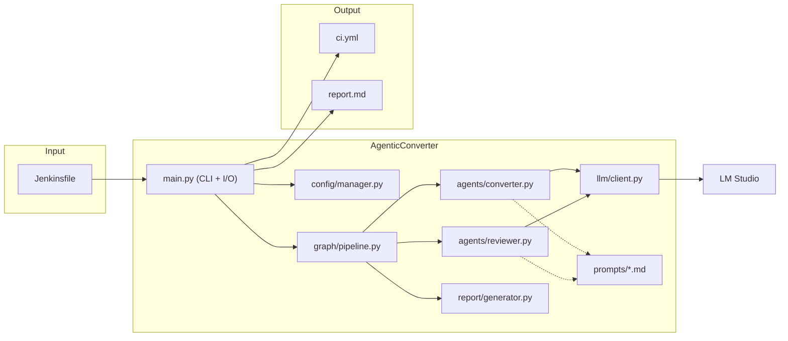
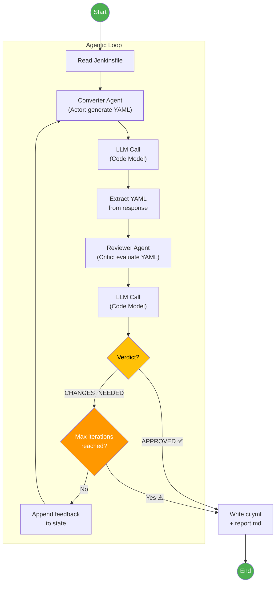
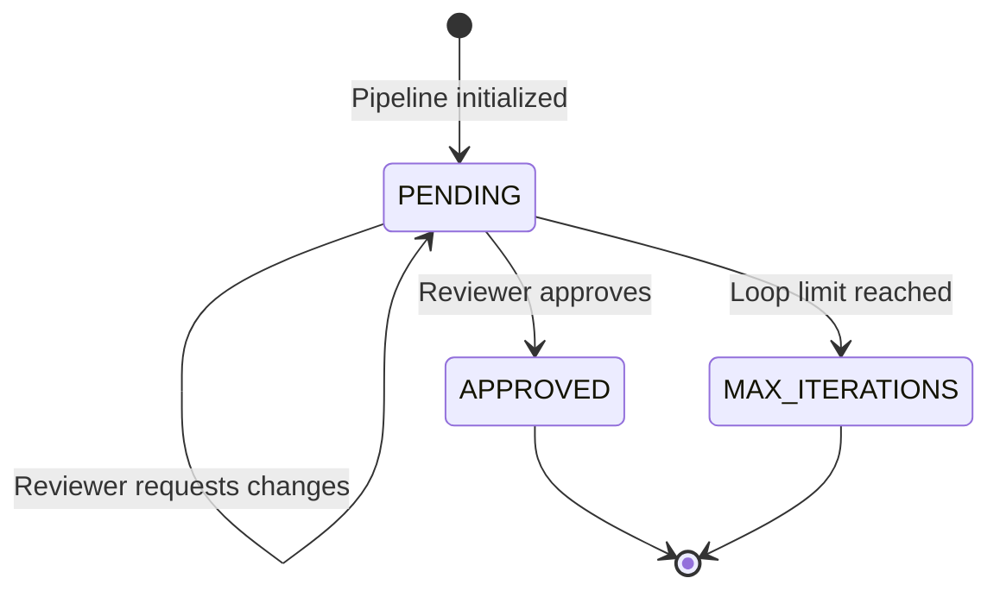
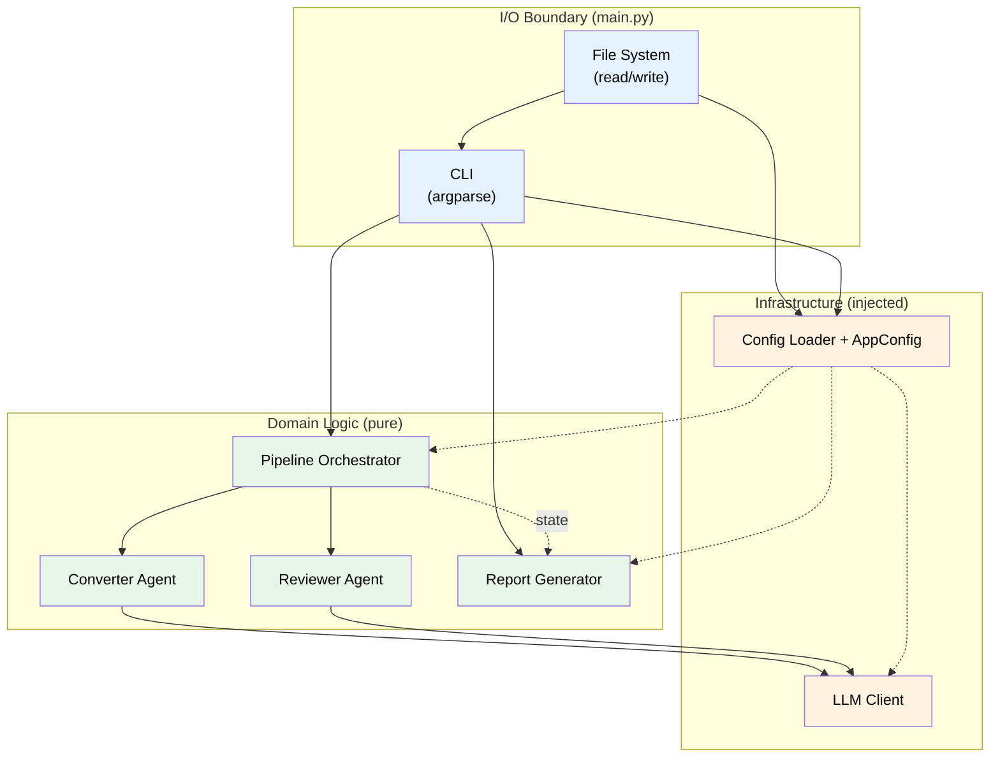
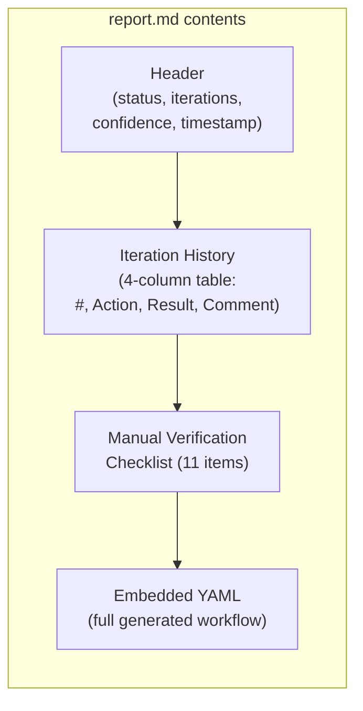
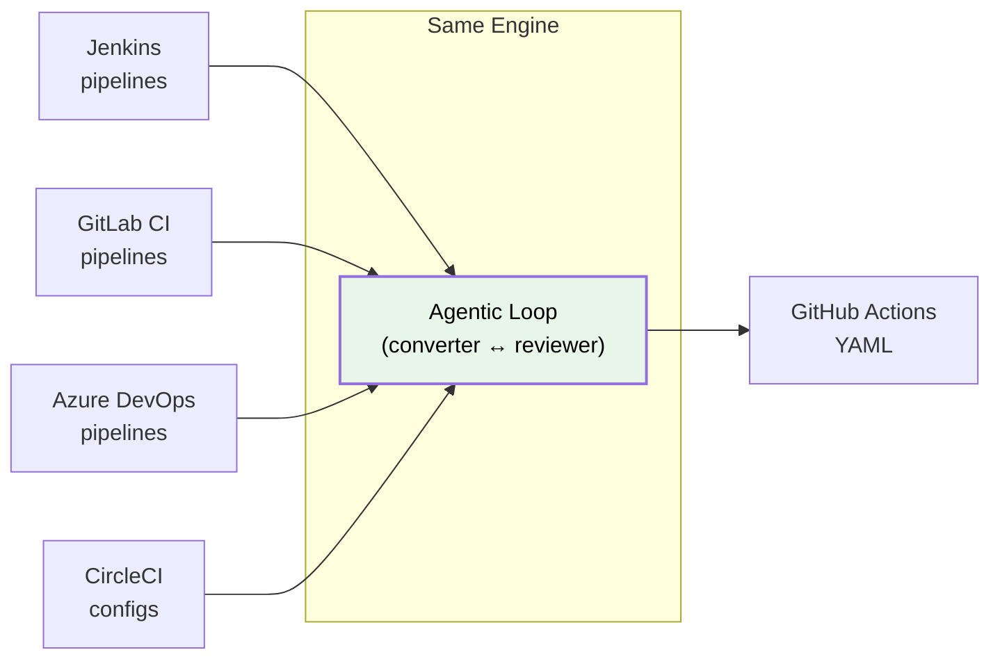
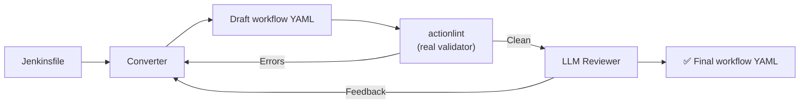
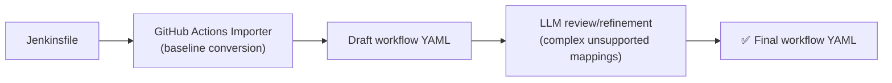
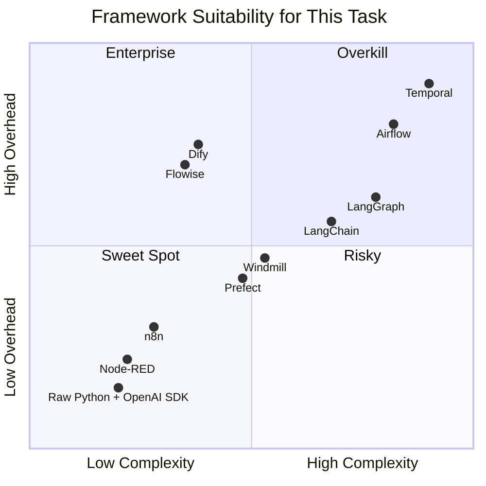
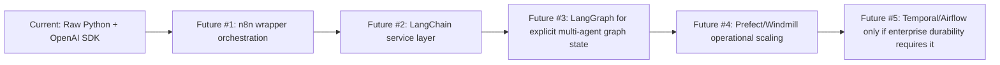

# AgenticConverter — Pitch Presentation

> This document covers the full architectural walkthrough, design rationale, and reflections
> for the AgenticConverter case presentation. It is designed to be self-contained for a
> 10–15 minute pitch.

---

## 1. What It Does

AgenticConverter is a CLI tool that converts Jenkins pipeline definitions (Jenkinsfiles)
into GitHub Actions workflow YAML. It uses an LLM served via an OpenAI-compatible endpoint
and an **iterative agentic loop** (the **Actor-Critic / Self-Refine** pattern) where two
specialized agents collaborate to produce high-quality output.

---

## 2. High-Level Architecture

### Module Responsibilities

| Module | Responsibility | Key Design Trait |
|---|---|---|
| `main.py` | CLI argument parsing, file reads/writes, orchestration entry point | **Only module with side-effects** (Clean Architecture I/O boundary) |
| `config/manager.py` | Loads and merges configuration from 3 layers (config/config.json → config/config.local.json → CLI) | Three-layer precedence chain |
| `graph/pipeline.py` | Defines `PipelineState` (Pydantic model), `IterationRecord`, and `run_pipeline()` loop | Immutable state transitions via `model_copy()` |
| `agents/converter.py` | Builds converter prompt, calls LLM, extracts YAML from response | Pure function: `(state, client, llm_params) → state` |
| `agents/reviewer.py` | Builds reviewer prompt, calls LLM, parses APPROVED/CHANGES_NEEDED verdict | Pure function: `(state, client, llm_params) → state` |
| `report/generator.py` | Computes confidence level, generates markdown report with checklist | Pure function: no I/O, no LLM calls |
| `llm/client.py` | Thin OpenAI SDK wrapper configured for LM Studio | Dependency-injected, not globally instantiated |
| `prompts/*.md` | System prompts stored as Markdown files | Decoupled from code: edit prompts without touching Python |

---

## 3. The Agentic Loop (Core Design)

The core mechanism is an **Actor-Critic (Self-Refine)** pattern — the same pattern
that LangGraph formalizes as a state machine, implemented here directly in pure Python.

### Engineer-Style Agent Tuning (Distinct Cognitive Roles)

The Converter and Reviewer nodes are intentionally tuned with different inference parameters because they perform fundamentally disparate kinds of work:

- **Converter (Synthesis Phase)**:
  - **Role**: Generate new YAML structure, map Jenkins concepts → GHA.
  - **Goal**: Good mapping coverage without hallucinating.
  - **Tuning**: Configured for synthesis logic (`temperature=0.35`, `top_p=0.95`, `top_k=40`, `max_tokens=4096`). Needs restrained creativity to interpret custom scripts and translate them.

- **Reviewer (Verification + Minimal Edits)**:
  - **Role**: Verification + minimal edits. Be strict, deterministic, catch mistakes.
  - **Goal**: Maximize correctness and repeatability. Reviewers should not "invent" steps; they must either approve exactly or produce the smallest correct patch. Make it boring + consistent.
  - **Tuning**: Configured for rigid determinism (`temperature=0.1`, `top_p=0.9`, `top_k=20`, `max_tokens=4096`).

### How State Flows

The pipeline state (`PipelineState`) is an **immutable Pydantic model**. Each agent
receives the full state and returns a new copy via `model_copy(update={...})`.
No mutation, no side effects inside agents.

---

## 4. Design Patterns & Principles

### 4.1. Clean Architecture

**Rule**: Conversion data I/O (reading Jenkinsfiles, writing `ci.yml`/`report.md`,
printing CLI progress) is centralized in `main.py`. Bootstrap config reads live in
`config/manager.py`, while the agents, pipeline, and report generator remain pure
and side-effect free. This keeps the domain layer fully testable offline.

### 4.2. Dependency Injection

The `LLMClient` is instantiated once in `main.py` from `AppConfig` and passed into
`run_pipeline()`. The same config source also provides runtime controls (`max_iterations`,
`output_dir`, `verbose`) and scoped converter/reviewer LLM parameters. Agents never
create their own clients.

**Benefits**:
- Tests inject a mock client → test suite runs offline without LM Studio
- Switch between local OpenAI-compatible endpoints with one config change
- No global state or singletons

### 4.3. Prompt Engineering as Configuration

System prompts live in `src/prompts/` as standalone Markdown files.
Developers can iterate on LLM behavior by editing `.md` files — no Python changes needed.
This separation makes prompt tuning accessible to non-developers.

---

## 5. Conversion Report

Each conversion generates a `report.md` alongside `ci.yml`, providing transparency
into the agentic process:

### Confidence Model

| Level | Condition | Meaning |
|---|---|---|
| **HIGH** | Approved in ≤ 2 iterations | Likely correct, minimal review needed |
| **MEDIUM** | Approved in 3–4 iterations | May need closer inspection |
| **LOW** | Max iterations reached or error | Manual review strongly recommended |

### Manual Verification Checklist (11 items)

The report includes a static checklist covering the most common Jenkins→GHA conversion
issues that automated tools frequently miss:

1. Secrets & Credentials
2. Custom Plugins
3. Shared Libraries
4. Self-Hosted Runners
5. Environment Variables
6. Post-Build Actions
7. Triggers
8. Artifacts & Workspace
9. Parallel Execution
10. YAML Validity
11. Other

---

## 6. Technology Stack

| Component | Technology | Rationale |
|---|---|---|
| Language | Python 3.10+ | Ecosystem leader for LLM tooling |
| Package Manager | uv | Fast, deterministic, replaces pip+venv |
| LLM Server | LM Studio / LightLLM | Local, OpenAI-compatible APIs |
| LLM Model | (Any Code Model) | Agentic loop operates independently of the underlying model |
| LLM SDK | openai | Standard API, works with any OpenAI-compatible backend |
| Data Validation | pydantic | Type-safe state models with immutable copies |
| YAML Handling | pyyaml | Validate generated output before writing |
| Testing | pytest | Industry standard, full offline test suite |
| Version Control | Conventional Commits | Clean, parseable commit history |
| Methodology | Spec Kit (Liatrio) | Spec → Plan → Tasks → Implementation |

---

## 7. Perspective & Future Extensions

### Scope Expansion (More Source Platforms)

The architecture is fundamentally a **"Document A → LLM Loop → Document B"** engine.
By swapping the system prompts (which are isolated `.md` files), the same application
can convert:

### Quality Assurance Extensions (Validation & Migration Workflow)

Two practical quality-assurance extensions are shown below: one for deterministic quality gates,
and one for importer-assisted remediation flow.

#### A) Deterministic Validation Gate

This extension adds a deterministic validator (`actionlint`) before final approval, so
syntax and rule violations are caught and sent back to the converter as concrete feedback.

#### B) Importer-Assisted Remediation Flow

This extension uses a hybrid migration chain: GitHub Actions Importer for baseline structure,
then LLM refinement for unsupported or complex mappings.

> Research states that even GitHub Actions Importer left substantial real-world
> gaps (Slack reported only about half fully converted without additional fixes), so they
> applied script/LLM correction passes and reported around 80% manual-effort reduction.

### Enabling Others with Agentic AI

- **Prompt-as-Configuration**: Non-developers can tune LLM behavior by editing Markdown
  files in `src/prompts/` without writing Python code.
- **Agnostic AI Gateway**: By configuring the application to point to a local endpoint (e.g., LightLLM or LM Studio), the system can switch between compatible local serving stacks while keeping routing centralized.
- **Reproducible Environments**: `uv sync` creates an identical virtual environment
  on any machine. No Docker, no containers, no cloud dependencies.

---

## 8. Framework Options & Priority Ranking

### 8.1 Distribution of Candidate Frameworks

Based on the latest research set, framework options fall into three practical groups:

- **Low-code / visual workflow tools**: `n8n`, `Node-RED`, `Flowise`, `Dify`
- **Code-first LLM frameworks**: `Raw Python + OpenAI SDK`, `LangChain`, `LangGraph`
- **General workflow orchestrators**: `Prefect`, `Windmill`, `Airflow`, `Temporal`

For this project, the relevant decision axis is pragmatic delivery fit:
how much control and reliability we gain versus how much adoption/operational overhead we add.

### 8.2 Complexity vs Overhead Snapshot

Reading guide: X-axis is **adoption complexity for this specific case**, not theoretical capability.

### 8.3 Comparison Tables by Category

#### Low-Code / Visual Platforms

| Framework | Positioning | Strengths | Trade-offs | Fit for This Case |
|---|---|---|---|---|
| n8n | Visual orchestrator with strong integration surface | Fast setup, OpenAI-compatible node support, clear demo UX | Runtime/UI platform overhead, logic complexity can move into flow config/JS nodes | **Priority future step #1** |
| Node-RED | Lightweight flow-based automation | Very low setup overhead, mature ecosystem | Less AI-native ergonomics than n8n | Viable lightweight alternative |
| Flowise / Dify | Visual AI workflow builders | Fast AI prototyping, multi-agent visual authoring | Heavier platform footprint for this PoC scale | Useful later, not immediate |

#### Code-First Frameworks

| Framework | Positioning | Strengths | Trade-offs | Fit for This Case |
|---|---|---|---|---|
| Raw Python + OpenAI SDK | Main implemented baseline | Minimal dependencies, explicit behavior, strongest debugging clarity | Manual loop durability/observability implementation | **Best current fit** |
| LangChain | High-level LLM abstraction toolkit | Rich ecosystem (tools/retrieval/memory), composable chains, strong velocity for feature expansion | Larger abstraction surface, higher cognitive load, version churn risk | **Priority future step #2** |
| LangGraph | Explicit agent state-machine runtime | Durable graph control, strong multi-agent modeling | Higher adoption complexity for 2-node loop | Better later-stage option |

#### Workflow Orchestrators

| Framework | Positioning | Strengths | Trade-offs | Fit for This Case |
|---|---|---|---|---|
| Prefect | Python-first orchestration | Better retries/state/observability while staying code-centric | Additional infra/runtime concepts | Good medium-term operational upgrade |
| Windmill | Script + flow platform | Multi-language scripting with orchestration UX | Larger platform footprint than current CLI | Viable depending on org standards |
| Airflow / Temporal | Enterprise orchestration and durability | Strong scheduling/auditability/durable execution | Highest operational complexity and setup overhead | Overkill for this scope |

### 8.4 Decision for This Moment

Current recommendation remains:
- Keep **Raw Python + OpenAI SDK** as the canonical implementation now.
- Implement **n8n next (#1)** for orchestration visibility and operational UX.
- Implement **LangChain next (#2)** once feature scope expands and composability benefits outweigh abstraction cost.

---

## 9. Future Upgrade Path (Framework Roadmap)

The roadmap below is explicitly aligned with future priorities:

| Step | Trigger Condition | Recommended Framework | Expected Outcome |
|---|---|---|---|
| Current | 2-node local conversion loop | Raw Python | Fastest path, highest transparency |
| Future #1 | Need visual orchestration and operational demos | n8n | Better workflow visibility without replacing core logic |
| Future #2 | Need richer reusable LLM composition and tooling integration | LangChain | Faster expansion of agent capabilities |
| Future #3 | Need explicit multi-agent graph-state control | LangGraph | Structured state-machine orchestration |
| Future #4 | Need stronger run-state, retries, scheduling, and operational controls | Prefect or Windmill | Improved reliability at medium complexity |
| Future #5 | Need enterprise-grade durability/audit/scheduling scale | Temporal or Airflow | Maximum robustness with highest overhead |

### 9.1 Priority Track Analysis: Main Baseline + Future Implementation Targets

#### Raw Python + OpenAI SDK (Main Baseline)

**Pros**
- Minimal runtime dependency surface (`openai`, `pydantic`, `pyyaml`).
- Full prompt/response transparency and straightforward debugging.
- Deterministic fit for converter↔reviewer loops.
- No framework lock-in; endpoint swap remains simple.
- Fast local/offline test loop with mocked clients.
- Strong alignment with the case requirement to stay practical and minimal.

**Cons**
- Reliability features (checkpoint/resume) are manual.
- No built-in observability UI.
- Complex branching/multi-agent scaling requires custom engineering.
- Orchestration responsibilities stay in application code.

#### n8n (Future Target #1)

**Pros**
- Fastest visual orchestration path for demos and stakeholder communication.
- Strong integration model (triggers, branching, retries, external systems).
- OpenAI-compatible integration path works with local endpoints.
- Good bridge for mixed technical/non-technical collaboration.
- Can wrap existing Python core without immediate full rewrite.

**Cons**
- Adds platform runtime and operational surface area.
- Complex transformations can shift into JS nodes and reduce testability.
- Flow diffs/review are less code-native than Python modules.
- Source-available licensing model may matter for some organizations.

#### LangChain (Future Target #2)

**Pros**
- Rich ecosystem for tools, retrieval, memory, and composable chains.
- Large community and broad example coverage.
- Accelerates feature growth when the converter expands beyond strict transformation.
- Useful stepping stone toward richer agentic behavior.

**Cons**
- Abstraction cost is higher than raw Python for a small deterministic loop.
- More implicit behavior can reduce transparency during debugging.
- Dependency/version churn can increase maintenance overhead.
- Easy to over-engineer if introduced too early.

---

## 10. Main vs Future Implementation

### Main Implementation

- **Core architecture**: Raw Python CLI with converter↔reviewer loop.
- **Quality controls**: Iterative review loop + conversion report generation.
- **Configuration**: File-based configuration with clear precedence.
- **Strength**: Minimal overhead, maximum implementation clarity and debuggability.

### Future Implementation

1. **Future #1: n8n wrapper orchestration**
   Outcome: visual workflow control and better operational visibility while preserving current core logic.
2. **Future #2: LangChain composition layer**
   Outcome: faster expansion for richer agent behavior, tools, and reusable prompt/chain composition.
3. **Future follow-on: LangGraph / Prefect / Windmill as complexity grows**
   Outcome: explicit graph-state and stronger workflow reliability when multi-agent/stateful needs become concrete.
4. **Future long-term only if justified: Temporal / Airflow**
   Outcome: enterprise-level durability and scheduling, accepted only with corresponding operational requirements.
