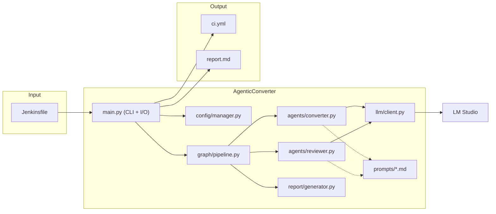
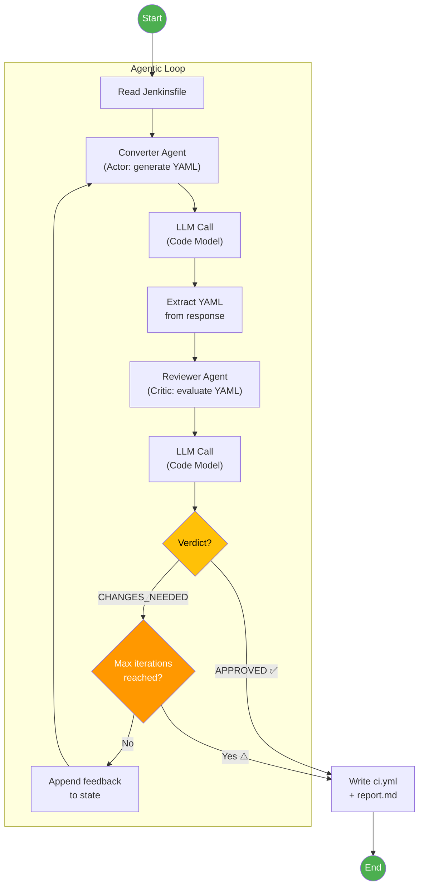
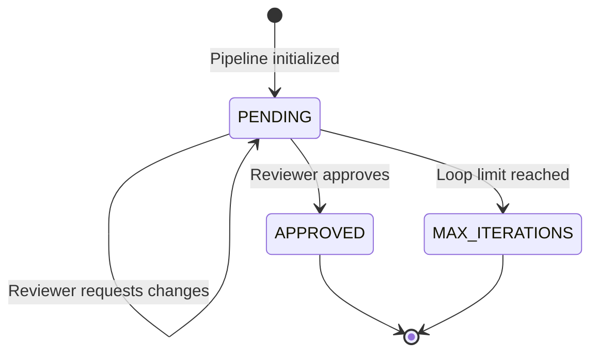
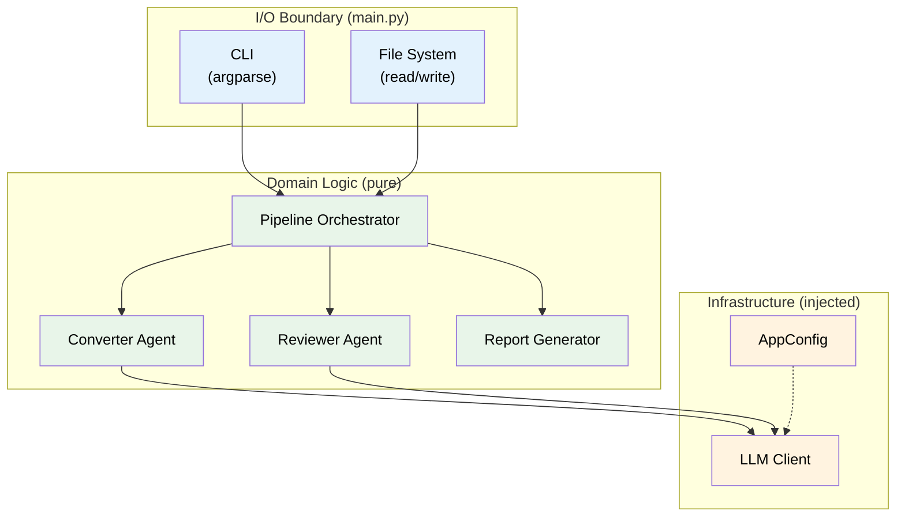
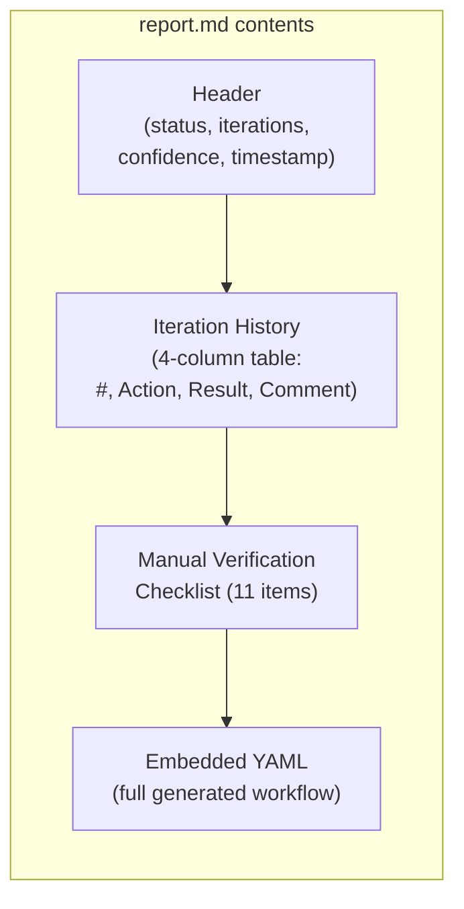
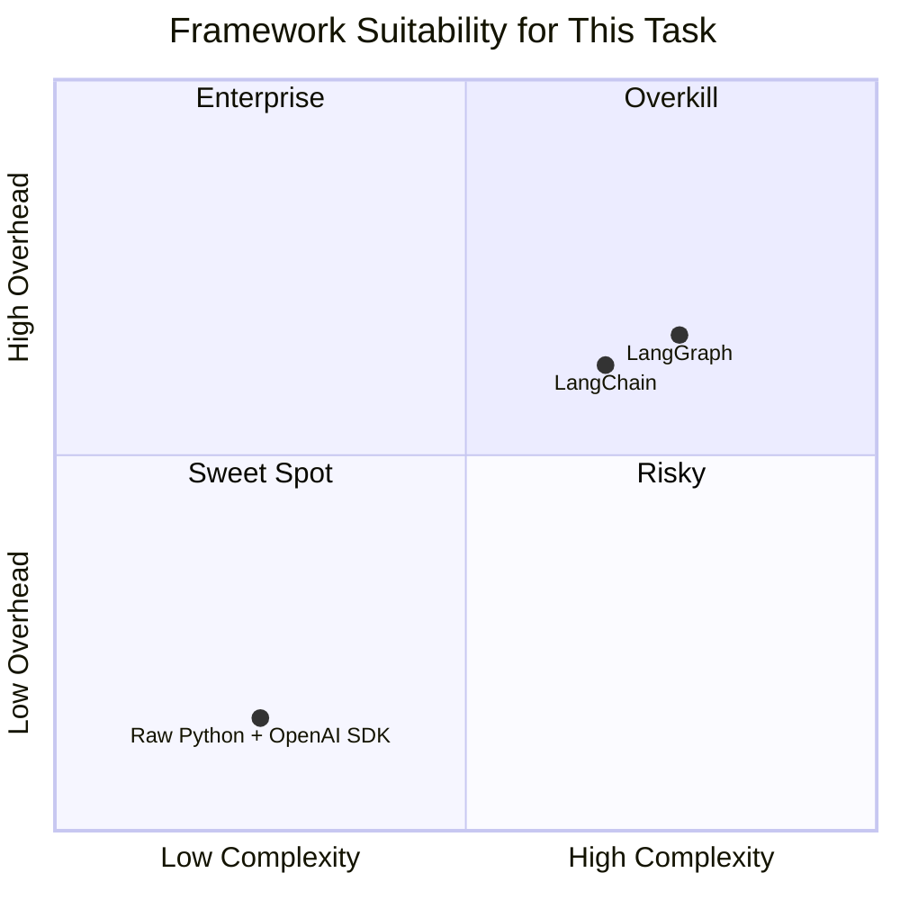
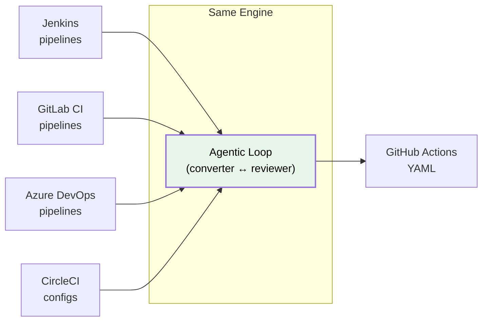
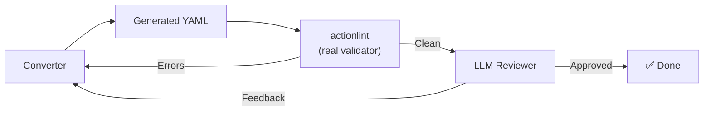

# AgenticConverter — Pitch Presentation

> This document covers the full architectural walkthrough, design rationale, and reflections
> for the AgenticConverter case presentation. It is designed to be self-contained for a
> 10–15 minute pitch.

---

## 1. What It Does

AgenticConverter is a CLI tool that converts Jenkins pipeline definitions (Jenkinsfiles)
into GitHub Actions workflow YAML. It uses an LLM served via an OpenAI-compatible endpoint
and an **iterative agentic loop** (the **Actor-Critic / Self-Refine** pattern) where two
specialized agents collaborate to produce high-quality output.

---

## 2. High-Level Architecture

### Module Responsibilities

| Module | Responsibility | Key Design Trait |
|---|---|---|
| `main.py` | CLI argument parsing, file reads/writes, orchestration entry point | **Only module with side-effects** (Clean Architecture I/O boundary) |
| `config/manager.py` | Loads and merges configuration from 3 layers (config/config.json → config/config.local.json → CLI) | Three-layer precedence chain |
| `graph/pipeline.py` | Defines `PipelineState` (Pydantic model), `IterationRecord`, and `run_pipeline()` loop | Immutable state transitions via `model_copy()` |
| `agents/converter.py` | Builds converter prompt, calls LLM, extracts YAML from response | Pure function: `(state, client, llm_params) → state` |
| `agents/reviewer.py` | Builds reviewer prompt, calls LLM, parses APPROVED/CHANGES_NEEDED verdict | Pure function: `(state, client, llm_params) → state` |
| `report/generator.py` | Computes confidence level, generates markdown report with checklist | Pure function: no I/O, no LLM calls |
| `llm/client.py` | Thin OpenAI SDK wrapper configured for LM Studio | Dependency-injected, not globally instantiated |
| `prompts/*.md` | System prompts stored as Markdown files | Decoupled from code: edit prompts without touching Python |

---

## 3. The Agentic Loop (Core Design)

The core mechanism is an **Actor-Critic (Self-Refine)** pattern — the same pattern
that LangGraph formalizes as a state machine, implemented here directly in pure Python.

### Engineer-Style Agent Tuning (Distinct Cognitive Roles)

The Converter and Reviewer nodes are intentionally tuned with different inference parameters because they perform fundamentally disparate kinds of work:

- **Converter (Synthesis Phase)**:
  - **Role**: Generate new YAML structure, map Jenkins concepts → GHA.
  - **Goal**: Good mapping coverage without hallucinating.
  - **Tuning**: Configured for synthesis logic (`temperature=0.35`, `top_p=0.95`, `top_k=40`, `max_tokens=4096`). Needs restrained creativity to interpret custom scripts and translate them.

- **Reviewer (Verification + Minimal Edits)**:
  - **Role**: Verification + minimal edits. Be strict, deterministic, catch mistakes.
  - **Goal**: Maximize correctness and repeatability. Reviewers should not "invent" steps; they must either approve exactly or produce the smallest correct patch. Make it boring + consistent.
  - **Tuning**: Configured for rigid determinism (`temperature=0.1`, `top_p=0.9`, `top_k=20`, `max_tokens=4096`).

### How State Flows

The pipeline state (`PipelineState`) is an **immutable Pydantic model**. Each agent
receives the full state and returns a new copy via `model_copy(update={...})`.
No mutation, no side effects inside agents.

---

## 4. Design Patterns & Principles

### 4.1. Clean Architecture

**Rule**: All file reads, writes, and stdout output happen **exclusively** in `main.py`.
The agents, pipeline, and report generator are pure functions with zero side effects.
This makes the entire domain layer testable offline without mocking file systems.

### 4.2. Dependency Injection

The `LLMClient` is instantiated once in `main.py` from `AppConfig` and passed into
`run_pipeline()`. Agents never create their own clients.

**Benefits**:
- Tests inject a mock client → test suite runs offline without LM Studio
- Switch between local OpenAI-compatible endpoints with one config change
- No global state or singletons

### 4.3. Prompt Engineering as Configuration

System prompts live in `src/prompts/` as standalone Markdown files.
Developers can iterate on LLM behavior by editing `.md` files — no Python changes needed.
This separation makes prompt tuning accessible to non-developers.

---

## 5. Conversion Report

Each conversion generates a `report.md` alongside `ci.yml`, providing transparency
into the agentic process:

### Confidence Model

| Level | Condition | Meaning |
|---|---|---|
| **HIGH** | Approved in ≤ 2 iterations | Likely correct, minimal review needed |
| **MEDIUM** | Approved in 3–4 iterations | May need closer inspection |
| **LOW** | Max iterations reached or error | Manual review strongly recommended |

### Manual Verification Checklist (11 items)

The report includes a static checklist covering the most common Jenkins→GHA conversion
issues that automated tools frequently miss:

1. Secrets & Credentials
2. Custom Plugins
3. Shared Libraries
4. Self-Hosted Runners
5. Environment Variables
6. Post-Build Actions
7. Triggers
8. Artifacts & Workspace
9. Parallel Execution
10. YAML Validity
11. Other

---

## 6. Reflection & Priority

### Why Raw Python + OpenAI SDK?

After researching **LangChain**, **LangGraph**, and custom Python loops across
10 independent sources, a raw Python approach was deliberately chosen.

Reading guide for the chart: the X-axis represents **complexity to adopt for this case** (team onboarding + implementation surface), not theoretical power.

For this assignment (`docs/CASE.md`: "keep it practical and minimal"), Raw Python remains the best fit. LangGraph can feel cleaner for explicit loops after setup, but it is generally a lower-level model and therefore not simpler to adopt for a small two-node PoC.

| Criterion | Raw Python | LangChain | LangGraph |
|---|---|---|---|
| Dependencies | 3 packages | Medium framework surface | Medium-high framework surface |
| Debuggability | Full visibility | Moderate | High after graph is modeled |
| Learning curve | Low | Medium | Medium-high (lower-level orchestration model) |
| Fit for 2-agent loop | Perfect | Good, but broad for this PoC | Good and explicit, but extra setup |
| Control over loop | Full (manual state machine) | Moderate | Very high (explicit state/edges) |

### Biggest Advantages

- **Zero Magic**: Every prompt and LLM call is visible and debuggable. When generating
  strict YAML syntax, abstraction layers hide the exact context sent to the LLM.
- **Minimal Footprint**: Only 3 runtime dependencies (`openai`, `pydantic`, `pyyaml`).
- **Testability**: Test suite runs offline in <2 seconds. No LLM server needed for CI.

### Trade-offs

- No built-in observability dashboard (like LangSmith).
- State management and loop limits are manually coded (trivial for a 2-agent loop).
- Adding 10+ agents would benefit from a framework — but this task has exactly 2.

---

## 7. Perspective & Future Extensions

### Horizontal Expansion

The architecture is fundamentally a **"Document A → LLM Loop → Document B"** engine.
By swapping the system prompts (which are isolated `.md` files), the same application
can convert:

### Vertical Expansion (Validation Layer)

A **Validator Node** could be added to the loop. Instead of relying solely on an LLM
reviewer, the pipeline could run `actionlint` (a real GitHub Actions linter) on the
generated YAML and feed actual linter errors back into the loop as structured feedback.

### Enabling Others with Agentic AI

- **Prompt-as-Configuration**: Non-developers can tune LLM behavior by editing Markdown
  files in `src/prompts/` without writing Python code.
- **Agnostic AI Gateway**: By configuring the application to point to a local endpoint (e.g., LightLLM or LM Studio), the system can switch between compatible local serving stacks while keeping routing centralized.
- **Reproducible Environments**: `uv sync` creates an identical virtual environment
  on any machine. No Docker, no containers, no cloud dependencies.

---

## 8. Technology Stack

| Component | Technology | Rationale |
|---|---|---|
| Language | Python 3.10+ | Ecosystem leader for LLM tooling |
| Package Manager | uv | Fast, deterministic, replaces pip+venv |
| LLM Server | LM Studio / LightLLM | Local, OpenAI-compatible APIs |
| LLM Model | (Any Code Model) | Agentic loop operates independently of the underlying model |
| LLM SDK | openai | Standard API, works with any OpenAI-compatible backend |
| Data Validation | pydantic | Type-safe state models with immutable copies |
| YAML Handling | pyyaml | Validate generated output before writing |
| Testing | pytest | Industry standard, full offline test suite |
| Version Control | Conventional Commits | Clean, parseable commit history |
| Methodology | Spec Kit (Liatrio) | Spec → Plan → Tasks → Implementation |
